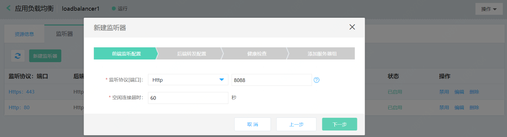

# 使用云主机、容器作为后端服务器部署

## 准备与规划

- 网络准备

	根据业务部署需要，提前规划应用负载均衡和作为后端服务器的云主机、容器的地域、可用区、私有网络等。
	
	注意：作为后端服务器的云主机、容器需要与应用负载均衡同一地域、私有网络。

- 服务器准备

	需提前创建承载业务流量的云主机、容器，并确保打开监听所需的端口，合理配置安全组、ACL策略。

## 创建一个HTTP监听器

- 前端监听配置：
	
	假设您已经创建了应用负载均衡实例、云主机、容器资源，下面我们以HTTP监听器为例，说明如何部署云主机、容器资源作为后端服务器。

	点击 **添加** 创建一个监听器：选择HTTP协议，配置端口、空闲连接超时，点击下一步。

	

- 后端转发配置：
	
	新建一个后端服务，配置后端服务名称、协议（默认）、端口、调度算法、开启会话保持、配置获取HTTP头字段，点击下一步。

	

- 配置健康检查：

	配置健康检查参数，点击下一步

	

- 新建服务器组：

	选择虚拟服务器组类型，点击新建一个服务器组。

	

- 虚拟服务器组添加主机、容器类型资源。
	
	填写虚拟服务器组名称，选择并添加主机、容器类型的资源实例，配置端口、权重。

	

- 绑定虚拟服务器组。

	选择并绑定这个虚拟服务器组，点击确定。

	

