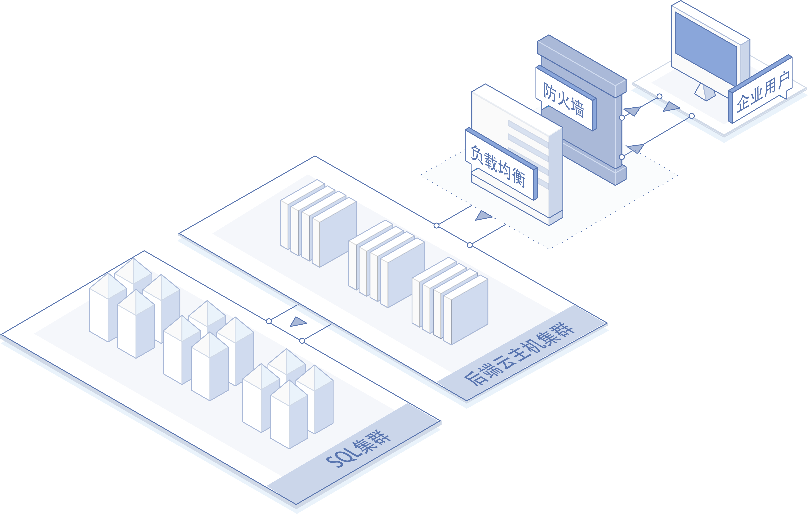
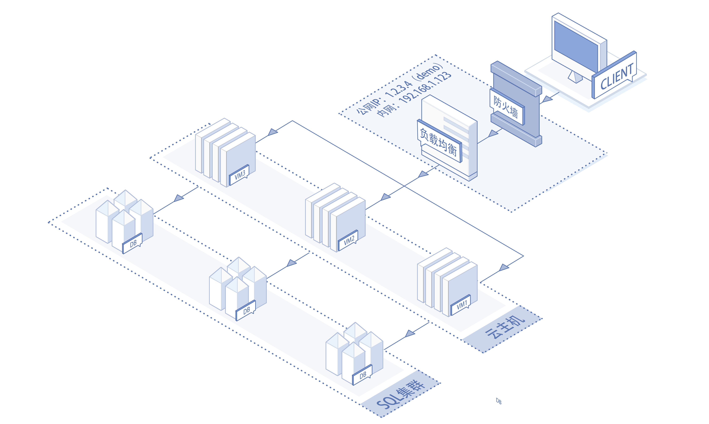
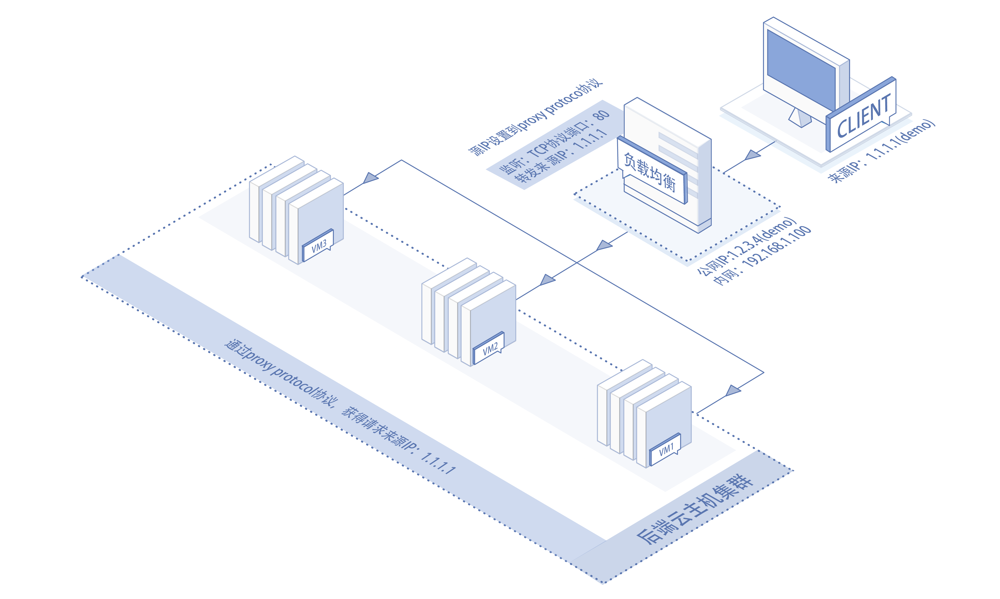
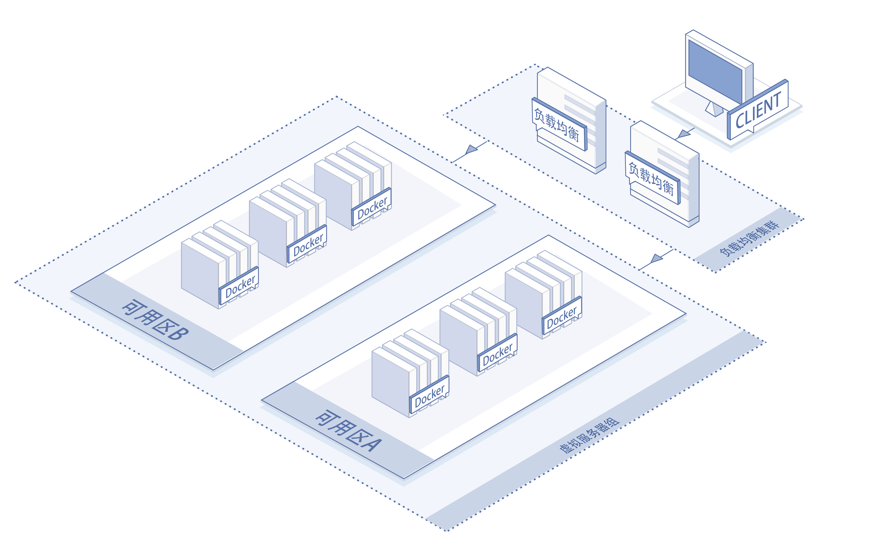
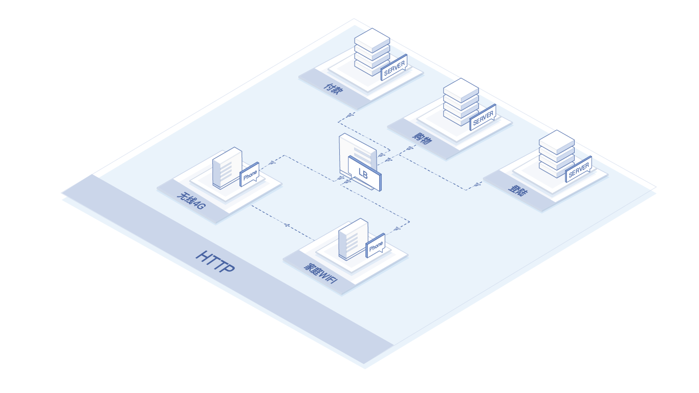

# 应用场景

以下说明 **负载均衡** 的适用场景。

## 弹性扩容场景
负载均衡后端绑定虚拟服务器组时，可使负载均衡将流量相对均匀的分配给多台后端服务器，绑定弹性伸缩组后可根据业务负载情况自动增加、减少后端服务器数量、以应对大流量、突发流量对系统造成的冲击，可应用于常规网站、大型业务网站、秒杀、抢购或其他可能导致突发流量增长的业务系统中。

## 多AZ高可用场景
负载均衡提供多重高可用保障机制，单实例采用集群部署（至少2个双活资源）、对后端服务器进行自动健康检查，如发现异常则不会将流量转发至该实例，直至实例运行正常后恢复；如需弹性扩容后端服务器可绑定高可用组，会根据业务负载情况自动增删后端服务器数量，高可用组会将后端服务器分布到不同的机架下，避免由于单一机架故障引起的系统故障；部分地域已支持多可用区服务，如需跨可用区高可用，可将负载均衡创建在不同的可用区，避免由于单一可用区故障引起的系统故障，提高系统可靠性，为客户提供更高的可用性保障。

## 高安全性场景
负载均衡可配置在内网环境，通过绑定公网IP提供对外服务，因此可隐藏内部网络结构，增强系统安全性；并且因内网部署，可通过设置安全组构建更加安全的防护体系。

## 客户真实IP溯源场景
支持HTTP/HTTPS监听协议下，通过X-Forwarded-For字段传递源IP信息，服务器识别X-Forwarded-For提取客户真实IP地址。也支持TCP监听协议下，通过proxy protocol v1协议支持传递客户真实IP。便于分析客户来源、统计运维数据和实现黑白名单访问控制等。

HTTP/HTTPS监听：

TCP监听：

## 使用容器作为后端服务场景
负载均衡支持绑定容器作为后端服务进行流量分发，支持容器加入统一虚拟服务器组进行负载分担，为微服务提供基础网络架构支持。

## 基于cookie的HTTP协议会话保持场景
负载均衡支持基于cookie的HTTP协议会话保持服务。举例说明：通过手机终端访问购物网站，在家庭WIFI环境完成登录和购物车添加商品操作，由于网络信号故障，切换为手机4G，继续完成付款操作。交换报文的首包按照调度算法（加权轮询、加权最小连接）选择后端服务器，同时在负载均衡生成cookie，通过HTTP回应报文发送给手机终端保存，后续报文基于cookie做会话保持，负载均衡将匹配相同cookie的报文转发到相同后端服务器。 

## 相关参考

- [产品优势](../Introduction/Benefits.md)
- [产品功能](../Introduction/Features.md)
- [价格总览](../Pricing/Price-Overview.md)
- [计费规则](../Pricing/Billing-Rules.md)
- [创建实例](../Getting-Started/Create-Instance.md)

