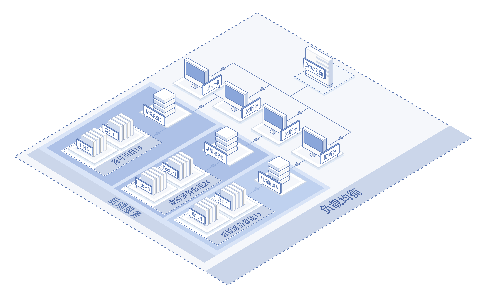
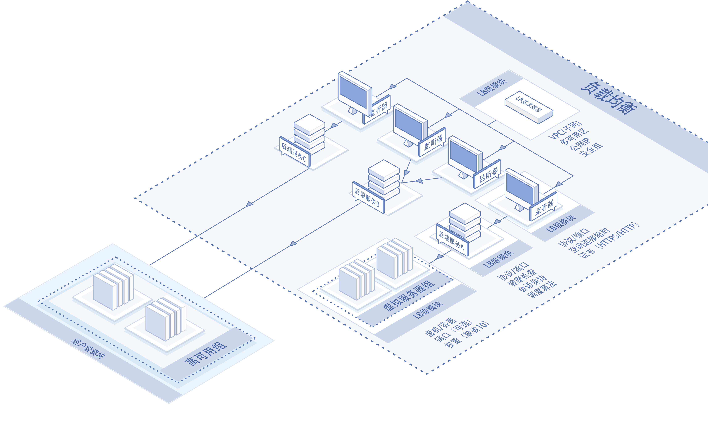
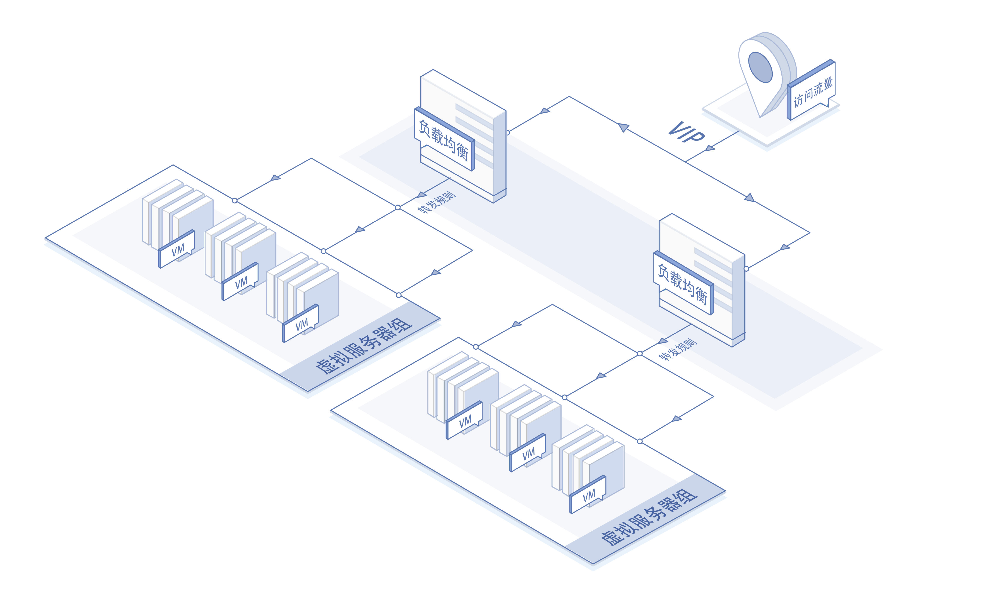

# 基础架构

- 负载均衡提供4、7层的负载监听服务，基于nginx架构实现TCP、HTTP、HTTPS协议下的流量转发。
- 负载均衡采用集群部署，通过设备冗余提高服务的可用性，消除设备单点故障。

## 组成部分

- 负载均衡实例

使用负载均衡服务前，需要购买、创建负载均衡实例，一个负载均衡实例可设置多个监听器、多个后端服务、多个虚拟服务器组，可以挂接多个高可用组。

- 监听器

进行流量负载前，需要设置至少一个监听器，指定监听协议/端口等。

- 后端服务

用于提供从负载均衡到后端服务器转发、调度策略的管理模块，包括转发协议/端口、调度算法、会话保持、转发的后端服务器组等。

- 虚拟服务器组

一组接收访问请求的云主机或容器资源，通过虚拟服务器组进行管理。虚拟服务器组可以与弹性伸缩（Auto Scaling）结合使用，以实现云主机的自动扩容与缩容，不过AS的主机分散能力较弱、不关注跨机架维度的高可用分散机制。

- 高可用组

高可用组（Availability Group）是京东云提供的云主机逻辑集合，可以支持按照用户指定主机模板进行跨机架、跨AZ的弹性伸缩，将云主机分散部署在相互隔离的物理资源上。当出现硬件或者供电故障时只会影响高可用组内部分云主机，业务仍为可用状态。

## 高复用架构

- 一个负载均衡实例下可以设置多个不同协议类型（HTTP/HTTPS/TCP）的监听器，也可以设置多个协议类型相同、但是不同服务端口号的监听器；

- 同一负载均衡下的多个监听器可以复用绑定同一个后端服务；

- 同一负载均衡的多个后端服务可以复用绑定同一个后端服务器组/高可用组；

- 同一虚拟服务器（主机/容器）可以通过不同端口注册到同一虚拟服务器组；

- 同一虚拟服务器（主机/容器）可注册到不同的虚拟服务器组；

- 同一高可用组可以挂接到同一负载均衡的多个后端服务；

- 同一高可用组可以挂接到多个负载均衡的后端服务。

	备注：虚拟服务器组中只能添加和所属负载均衡实例相同私有网络的服务器。

## 分流原理

来自外部的访问请求，由负载均衡实例根据相关的策略和转发规则分发到后端服务器进行处理。目前负载均衡支持的分流类型包括： 加权轮询、加权最小连接、源IP。轮询是按序逐个向后端服务实例分发连接请求，加权轮询就是按照实例的权重比例分配轮中次数。最小连接是按照负载均衡与各个后端服务实例之间的最小活跃连接数进行分发请求，加权最小连接就是最终保证负载均衡与后端服务之间的活跃连接数比例与权重比例一致。源IP是指依据请求的源IP地址进行hash，把不同源IP的请求分配到不同后端服务实例。

## 会话保持原理

会话保持又称粘滞会话(Sticky Sessions、Session affinity)。会话保持是指负载均衡器上的一种功能机制，在进行数据分发的同时保证来自同一客户端相关连的访问请求会分配到同一台服务器上。

针对七层HTTP/HTTPS协议会话保持，负载均衡负责插入cookie，后端服务器无需作出任何修改。当客户端进行第一次请求时，客户端的HTTP request（不带cookie）进入负载均衡器， 负载均衡根据调度算法策略选择后端一台服务器，并将请求发送至该服务器；后端服务器的HTTP response（不带cookie）被发回给负载均衡器。接下来负载均衡器将向该HTTP response插入cookie（保存后端服务器关联信息），并将HTTP response返回到客户端。

当客户请求再次发生时，客户HTTP request（带有上次负载均衡器插入的cookie）进入负载均衡，然后负载均衡读出cookie里的会话保持数值，将HTTP request（带有与上面同样的cookie）发到指定的服务器，然后后端服务器进行请求回复；由于服务器并不写入cookie，HTTP response将不带cookie，该HTTP response进入负载均衡时，负载均衡将向该HTTP response写入更新老化时间后的cookie，并将HTTP response返回到客户端。

## 相关参考

- [产品优势](../Introduction/Benefits.md)
- [产品功能](../Introduction/Features.md)
- [价格总览](../Pricing/Price-Overview.md)
- [计费规则](../Pricing/Billing-Rules.md)
- [创建实例](../Getting-Started/Create-Instance.md)
- [创建虚拟服务器组](../Operation-Guide/TargetGroup-Management.md)
- [配置侦听策略](../Operation-Guide/Listener-Management.md)
- [管理后端服务与查看服务实例健康状态](../Operation-Guide/Backend-Management.md)
- [查看监控信息](../Operation-Guide/Monitoring.md)

