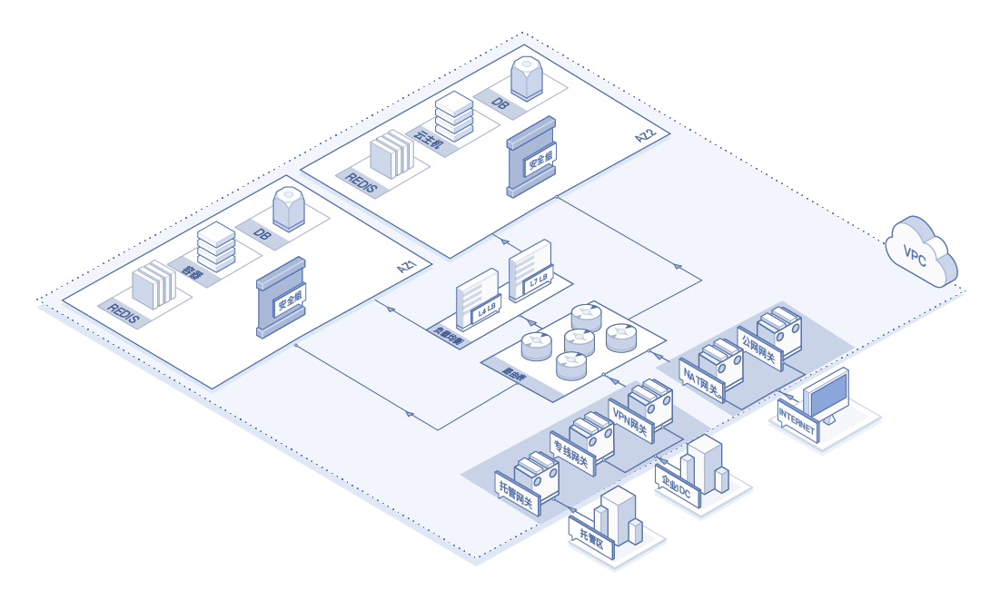
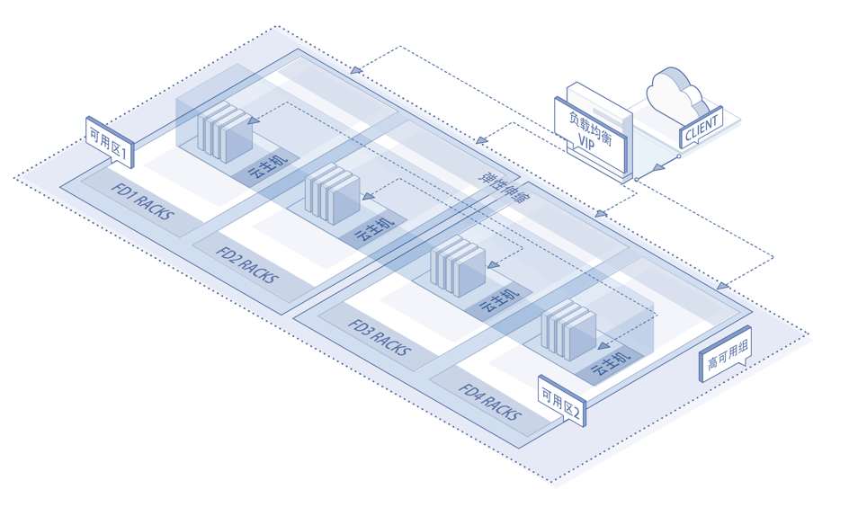

# 产品简介

应用负载均衡可将大并发流量分发到多台后端实例，调整资源利用情况，消除由于单台设备故障对系统的影响，提高系统可用性、扩展系统服务能力。

京东云私有网络部署：

## 应用负载均衡升级说明

京东云于2018年6月28日率先在华南地域上线了升级版的应用负载均衡产品，升级产品能够完整兼容旧版应用负载均衡的功能，用户原来创建的应用负载均衡及其配置会平滑升级到新架构的应用负载均衡产品中，用户不用做任何操作或者修改即可继续使用相关功能服务。

升级版的应用负载均衡产品，主要包括了两部分变化：

- 功能增强：增加支持高可用组与容器作为业务分发对象；增加管理空闲超时时间配置；增加后端服务实例健康检查结果展示功能；增加支持HTTP请求头字段能力（支持X-Forwarded-For、X-Forwarded-Proto、X- Forwarded-Port 、 X-Forwarded-LBIP和X-Forwarded-Host几个HTTP头字段，其中X-Forwarded-For是缺省打开，不能关闭；其他几个是缺省关闭，可以设置打开）。

- 结构调整：原有的监听规则拆分为监听器与后端服务两个模块，以便结构清晰以及复用后端服务。监听器用于定义监听的协议类型与端口等客户端业务请求区分规则；后端服务模块用于定义服务端的协议类型与端口，并挂接高可用组或者虚拟服务器组。虚拟服务器组除了可以注册虚拟主机之外，还可以注册容器实例（虚拟主机与容器实例可以在一个虚拟服务器组中共存）。

## 提供多重保障的高可用服务

京东云应用负载均衡提供多重机制保障服务的高可用：

- 应用负载均衡的高可用：

	- 多可用区部署：根据业务需求，对支持多可用区的地域可选择将应用负载均衡实例部署在多个可用区下，一旦可用区机房故障或可用区下资源故障，可将流量自动分发至其他可用区，实现可用区级高可用；

	- 资源冗余机制：应用负载均衡采用集群部署，提供双活模式（单可用区下至少提供2个资源实例），如一个负载均衡服务故障，可将流量自动转发至另一个负载均衡服务，业务侧无感知。

- 后端服务器的高可用：

	应用负载均衡可绑定高可用组，根据业务流量和设备负载情况动态调整服务器数量，实现资源的合理分配，保证业务正常运行。

## 应用负载均衡主要功能

- 流量分发：应用负载均衡服务通过设置虚拟服务地址VIP，将相同VPC下的后端实例（云主机/容器）虚拟为一个服务资源池，可将前端客户的访问流量按照指定的规则分发至后端服务资源池进行处理，提升用户对外服务能力。

- 多种协议侦听：应用负载均衡支持TCP/TLS/HTTP/HTTPS等多种协议的不同端口侦听服务，以支持丰富多样的客户端服务接入和流量分发。

- 自动健康检查：应用负载均衡服务会检查后端服务资源池中实例的健康状态，自动隔离、挂载后端提供服务的实例，消除设备单点故障，保障业务正常运行。

- 自动调节后端实例数：应用负载均衡后端可以绑定指定的高可用组，通过设置弹性伸缩策略，自动调整后端服务实例数量，合理配置资源。

- 防DDoS攻击：京东云免费为应用负载均衡服务提供基于公网IP的DDoS基础防护，最大支持2G的抗DDoS攻击能力，提升了服务的安全性能。详见[DDoS基础防护](https://docs.jdcloud.com/cn/anti-ddos-basic/product-overview)。

- 会话保持：应用负载均衡支持基于HTTP/HTTPS协议类型的会话保持功能。

- 空闲连接超时：应用负载均衡支持基于TCP/TLS/HTTP/HTTPS协议的空闲连接超时。

- 源IP透传：应用负载均衡支持基于TCP/TLS/HTTP/HTTPS协议的客户端IP透传功能。

- 支持WebSocket：WebSocket为客户端和服务器提供双向通信的通道，能更好的节省服务器资源及带宽，保证通信的实时性。

## 相关参考

- [核心概念](../Introduction/Core-Concepts.md)
- [产品优势](../Introduction/Benefits.md)
- [产品功能](../Introduction/Features.md)
- [价格总览](../Pricing/Price-Overview.md)
- [计费规则](../Pricing/Billing-Rules.md)
- [创建负载均衡实例](../Getting-Started/Create-Instance.md)
- [创建高可用组](../Getting-Started/Create-AvailabilityGroup.md)
- [创建虚拟服务器组](../Operation-Guide/TargetGroup-Management.md)
- [配置侦听策略](../Operation-Guide/Listener-Management.md)
- [管理后端服务与查看服务实例健康状态](../Operation-Guide/Backend-Management.md)
- [查看监控信息](../Operation-Guide/Monitoring.md)
