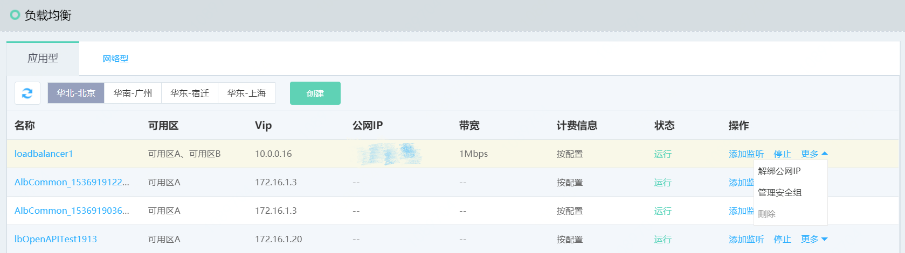

# 应用负载均衡管理

1. 添加监听：通过应用负载均衡列表页-操作栏，点击添加监听跳转至监听器管理页面；

2. 启动/停止：通过应用负载均衡列表页-操作栏，可启动、停止应用负载均衡实例；

3. 绑定/解绑公网IP：如需应用负载均衡提供外网服务，需绑定公网IP，同理可解绑公网IP，可通过应用负载均衡列表页-操作栏进行操作；

4. 删除应用负载均衡：通过应用负载均衡列表页-操作栏，可删除应用负载均衡；

5. 点击实例名称可查看资源详细信息；

6. 通过应用负载均衡详情页可修改应用负载均衡名称、描述信息，关闭或开启删除保护开关；

	注：启动、删除、绑定公网ip等也可以通过资源详情页右上角菜单进行操作。

