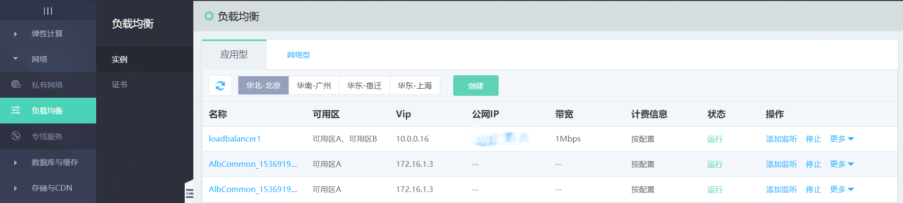
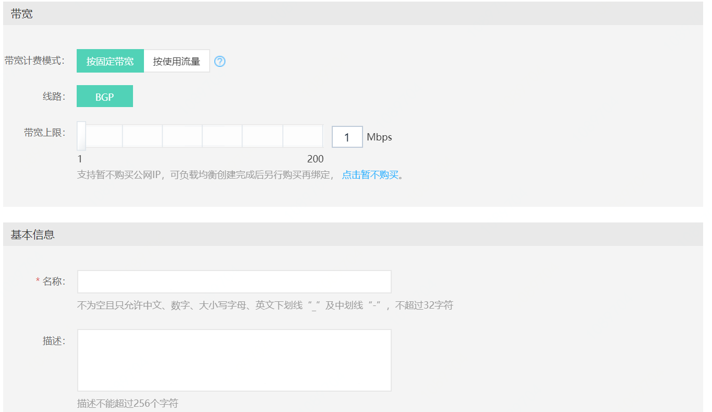
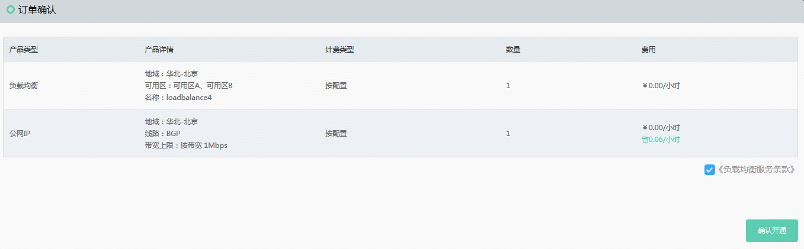
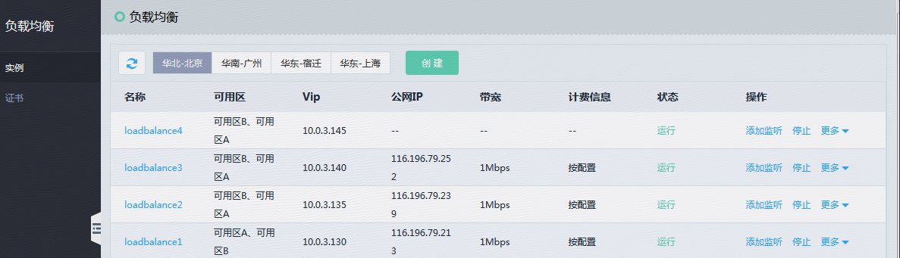

# 创建应用负载均衡

1. 通过菜单-网络-负载均衡进入应用负载均衡列表页。

	

1. 点击“创建”新建一个应用负载均衡实例。

1. 选择地域，注意和需要选择的私有网络所在地域保持一致。

1. 选择可用区，应用负载均衡只能将流量转发至所选可用区内的后端服务器。

1. 选择所属私有网络、子网信息，应用负载均衡只能将流量转发至同私有网络下的后端服务器。

1. 配置安全组：配置应用负载均衡实例需绑定的安全组，默认绑定一个端口全开的安全组。

1. 选择公网IP计费方式：按固定带宽或者按使用流量计费；如创建内网类型的应用负载均衡，可选择暂不购买，也可以在应用负载均衡创建完成后再绑定公网IP。

1. 填写应用负载均衡名称、描述。

1. 页面右侧确认配置及费用信息，点击 **立即购买**。

	

	

1. 确认订单信息并完成支付，创建应用负载均衡实例。

	

1. 完成应用负载均衡实例创建；因资源创建需一定时间（通常为几秒），可手动刷新列表页查看状态。

	
