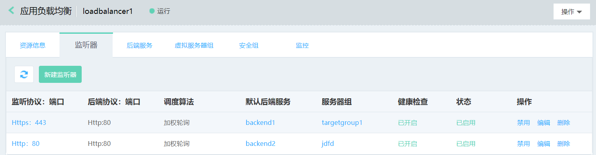

# 监听器管理

## 添加监听器

1. 通过负载均衡-详情-监听器进入监听器管理页；

2. 点击新建监听器，打开监听器设置页；

3. 监听器设置：
	
	**前端监听配置：**
	
	- 选择前端监听协议：http、https、tcp、tls；端口：1-65535；	
		注：同一负载均衡下的监听端口不可重复，监听器创建后，监听协议、端口不允许修改；	
	- 空闲连接超时：输入范围1-86400秒；

		

	**后端转发配置：**

	- 默认后端服务：新建或选择一个已有的后端服务，选择已有后端服务相关参数不可修改；
	
	- 后端服务名称：定义后端服务名称，随监听器同步创建的后端服务可在后端服务列表查看；	
	
	- 后端协议：默认显示，如监听协议为http、https则后端协议为http，如监听协议为tcp、tls则后端协议为tcp；
	
	- 端口：后端业务转发端口，输入范围1-65535，不同后端服务的端口可以重复；
	
	- 调度算法：加权轮询、加权最小连接数、源IP，可根据实际业务需求选择；
	
	- 会话保持：默认关闭，后端协议为http时支持植入方式的cookie会话保持；	
	
	- cookie超时时间：输入范围0-86400，默认0代表与浏览器同生命周期；	
	
	- 获取真实IP：后端协议为http时，默认开启不可关闭，此时可通过X-Forwarded-For头字段获取客户端真实IP；后端协议为tcp时，支持proxy protocol协议方式透传客户端IP；
	
		注：当后端协议为tcp时，如开启获取真实IP，需在后端服务端完成proxy protocol的相关配置。
		
	- 获取http头字段：可选择X-Forwarded-Proto、 X-Forwarded-Port、X-Forwarded-LBIP 、X-Forwarded-Host 多项，用于透传客户端http请求的相关信息；

			

	**健康检查设置：**

	- 选择健康检查方式：HTTP、TCP；
	
	- 设置检查端口：输入范围1-65535，如不填写默认为后端实例接收负载均衡流量的端口；
	
	- 响应超时时间(s)：输入范围2-60秒,此为健康检查响应的最大超时时间；
	
	- 健康检查间隔(s):输入范围为5-300秒,此为健康检查的时间间隔；
	
	- 不健康阈值：输入范围1-5，此为后端实例从成功到失败的连续健康检查失败次数；
	
	- 健康阈值：输入范围1-5，此为后端实例从失败到成功的连续健康检查成功次数；
	
	- 正常态码：输入范围2xx（等价于200-299）、3xx（等价于300-399）、4xx（等价于400-499）；
	
	- 检查路径：仅健康检查方式为HTTP时填写，必须以“/”开头、最多支持5级目录，不得超过100字符。

		

	**添加服务器组：**

	- 选择服务器组类型：虚拟服务器、高可用组，或者可以暂不添加；
	
	- 虚拟服务器组：系统会自动筛选出当前可以绑定的服务器组列表，如没有可用的服务器组，可点击“新建虚拟服务器组”进行创建；	
	
		注：可选服务器组中的后端实例必须与负载均衡处于相同地域、私有网络、可用区下。

	- 高可用组：系统会自动筛选出当前可以绑定的高可用组，如没有可用的高可用组，请前往高可用组页面进行创建；注：可选高可用组中的后端实例必须与负载均衡处于相同地域、私有网络、可用区下。

		

## 管理监听器

1. 查看监听详情：通过监听器列表页-操作栏，点击详情可查看监听器详细信息；

2. 启用/禁用监听器：通过监听器列表页-操作栏，可启用、禁用监听器；

3. 编辑监听器：通过监听器列表页-操作栏，可编辑监听器内容（详见下文）；

4. 删除监听器：通过监听器列表页-操作栏，可删除监听器。

	
## 编辑监听器

1. 证书：如监听器有绑定的证书，可修改；

2. 空闲连接超时：可修改；

3. 默认后端服务：可替换新的后端服务。注：只能选择与监听器协议匹配的后端服务，如监听协议为http、https，则可选后端协议为http的后端服务；如监听协议为tcp，则可选后端协议为tcp的后端服务。

4. 其他参数项不支持修改。

	

