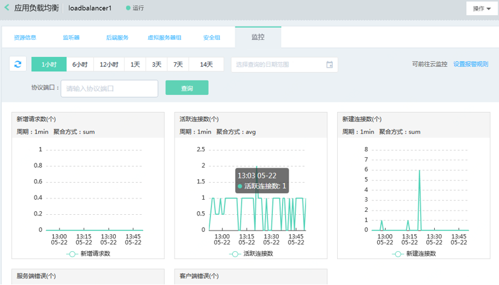

## 监控管理

1. 通过负载均衡-详情-监控打开监控页；

1. 选择查看数据的周期：支持查看最少1小时、最大14天或指定日期范围（当月最多30天）的监控数据；

1. 协议端口：默认显示负载均衡全部监听器的监控数据，也可输入指定的端口号查看对应监听器的监控数据；

1. 如您需要对监控指标设置报警规则，可点击“设置报警规则”前往云监控页面进行设置。

	

| 监控指标	| 说明	|
| :- | :- |
|新增请求数	|统计周期内，从客户端到负载均衡新增HTTP/HTTPS（仅限7层）请求数。	|
|活跃连接数	|从客户端到负载均衡所有ESTABLISHED状态的TCP连接数时刻值。	|
|新建连接数	|统计周期内，从客户端连接到负载均衡新建TCP连接数。	|
|服务端错误	|统计周期内，由服务端问题造成的请求失败数。|
|客户端错误	|统计周期内，由客户端问题造成的请求失败数。|

