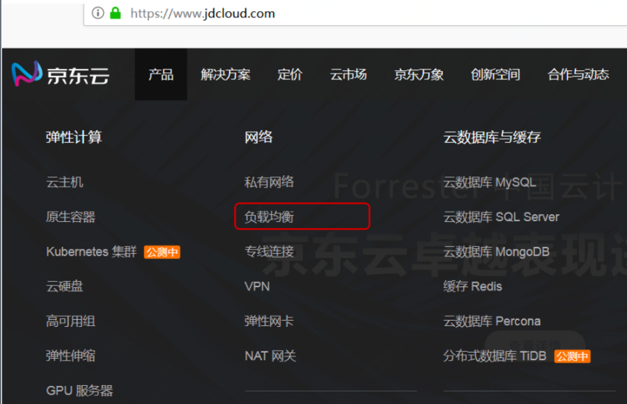
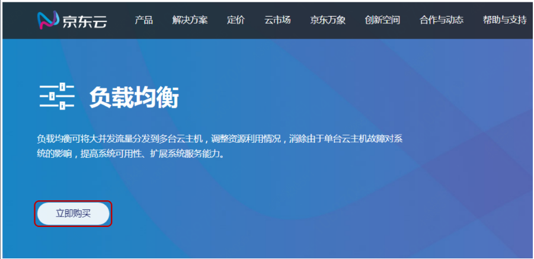

# 购买流程

本文介绍 负载均衡 实例的购买入口。

## 入口1：[产品介绍页](https://www.jdcloud.com/products/loadbalance)
1. 登录京东云官网[https://www.jdcloud.com/](https://www.jdcloud.com/)。
2. 选择“产品>网络 负载均衡”，具体见下图。

3.弹出负载均衡的产品介绍页，点击**立即购买**。

4.购买的具体操作，请参考[创建实例](../../../../documentation/Networking/Load-Balancer/Operation-Guide/Create-ALB-Instance.md)。

## 入口2：[LB 控制台](https://console.jdcloud.com/host/loadBalance/list)

1. 登录京东云官网[https://www.jdcloud.com/](https://www.jdcloud.com/)。
2. 选择“控制台”，具体见下图。

3.登录控制台，具体操作请参考[创建实例](../../../../documentation/Networking/Load-Balancer/Operation-Guide/Create-ALB-Instance.md)。
