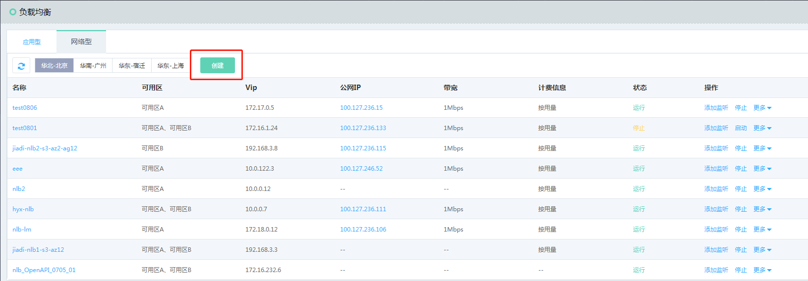
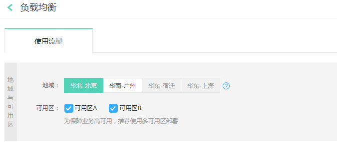
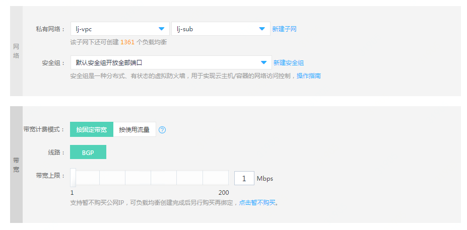
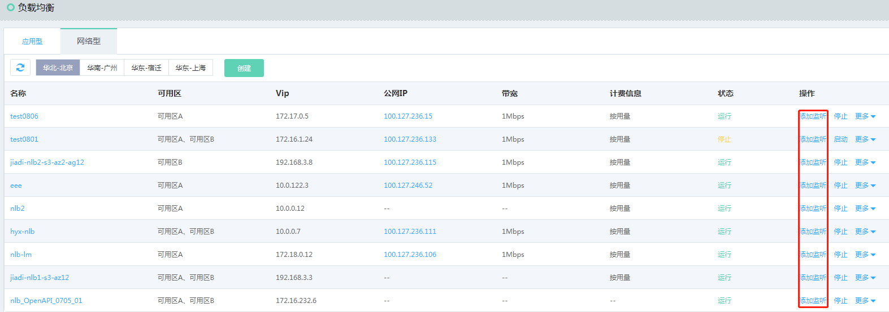
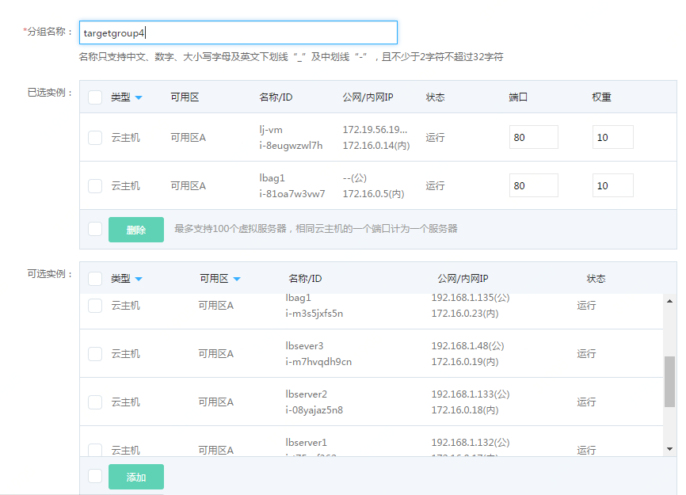

# 创建跨可用区高可用负载均衡

## 准备与规划

- 网络准备

  根据业务部署需要，提前规划负载均衡和作为后端服务器的云主机、容器的地域、可用区、私有网络等。

- 服务器准备

  需提前创建承载业务流量的云主机、容器，并确保打开监听所需的端口，合理配置安全组、ACL策略。【注意：只有创建了负载均衡实例的可用区，才能将可用区下的云主机、容器配置为后端服务。例如，负载均衡在可用区A、可用区B，则可以设置可用区A、可用区B内的云主机、容器进行流量转发。】

	
## 创建负载均衡实例

#### 1. 通过控制台菜单-负载均衡打开负载均衡资源列表页，点击 **创建** 新建一个负载均衡实例。

#### 2. 选择负载均衡类型：选择网络负载均衡。
 
 

#### 3. 选择相应的地域：华北-北京，可用区：可用区A、可用区B。

#### 4. 选择私有网络、子网，绑定公网IP并选择计费方式、带宽。

#### 5. 填写负载均衡名称、描述。

#### 6. 确认配置信息，点击 **立即购买**。

#### 7. 确认订单信息并完成支付，创建负载均衡实例。

#### 8. 刷新负载均衡列表，查看新创建的负载均衡实例。

#### 9. 点击列表右侧 **添加监听** 打开监听器页。

## 配置监听策略

#### 1. 创建TCP监听器：

- 点击 **新建监听器** 创建一个监听器;

- 前端监听配置：配置监听协议为TCP，端口80；

- 空闲连接超时：设置空闲连接超时时间。

#### 2. 后端转发配置：

- 默认后端服务：可以新建后端服务或者选择已有后端服务；

- 后端服务名称：定义后端服务名称；

- 后端协议：根据监听协议显示对应的默认协议；

- 端口：定义后端转发端口；

- 调度算法：根据业务需要选择，指定为加权轮询；

- 会话保持：开启/关闭； 缺省超时时间为1440s，为会话保持的最小保证时间，在此期间内、无论NLB以及后端服务如何弹性扩展，所有源、目的IP相同的报文会保证转发到同一个后端服务器。当会话保持时间超时后，报文不能保证转发到同一个后端服务器；

- 连接耗尽：连接耗尽超时时间设置。当一个服务器从“虚拟服务器组”或者高可用组（AG）中摘除时，开始启动连接耗尽计时器，此后只有已建立的TCP连接报文会继续向该服务器转发、直到连接耗尽时间超时为止，而新建立的TCP连接将不会向该服务器转发；

- 健康检查：选择健康检查方式为：HTTP/TCP。

#### 3. 添加服务器组：

- 根据业务需要选择虚拟服务器组、高可用组；

- 虚拟服务器组添加服务器;

- 如没有可用的虚拟服务器组，点击“新建虚拟服务器组”创建一个新的虚拟服务器组，可选云主机、容器，定义实例的端口、权重【注：只能选择与负载均衡同可用区和私有网络下的云主机、容器资源】。

## 创建完成

这样一个跨可用区的负载均衡HTTP监听器配置完成，当单个可用区（如可用区A）发生故障时，负载均衡会将流量转发至可用区B，保证业务正常运行。
		
