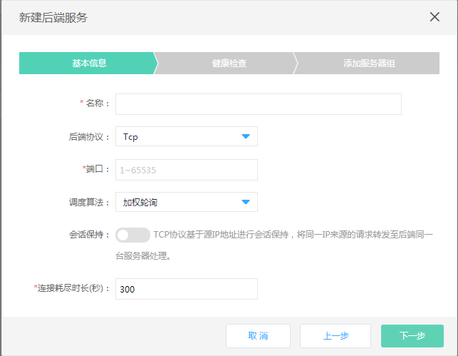
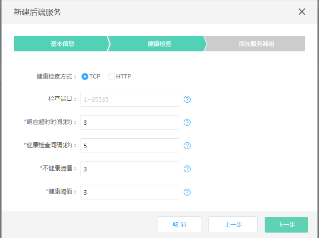
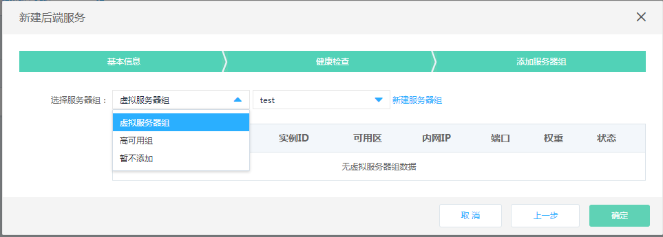

# 创建后端服务

##### 1. 通过负载均衡-详情-后端服务进入后端服务管理页；

##### 2. 点击 **新建后端服务**，打开后端服务创建页；

##### 3. 后端服务设置：
	
###### 基本信息：
	
- 名称：定义后端服务名称；
	
- 后端协议：可选TCP；注意：监听器只能与对应协议类型的后端服务绑定，后端协议为tcp时，只能绑定监听协议为tcp的监听器；

- 端口：输入范围1~65535，不同后端服务的端口可以重复；

- 调度算法：支持加权轮询、加权最小连接数和源IP；

- 会话保持：会话保持开关，打开后时间为1440s；
	
- 连接耗尽：设置连接耗尽时间，范围为【0，3600】秒，缺省为300秒。

###### 健康检查设置：

- 选择健康检查方式：HTTP、TCP；

- 设置检查端口：输入范围1~65535，如不填写默认为后端实例接收负载均衡流量的端口；

- 响应超时时间(s)：输入范围2~60秒,此为健康检查响应的最大超时时间；

- 健康检查间隔(s):输入范围为5~300秒,此为健康检查的时间间隔；

- 不健康阈值：输入范围1~5，此为后端实例从成功到失败的连续健康检查失败次数；

- 健康阈值：输入范围1~5，此为后端实例从失败到成功的连续健康检查成功次数；

- 正常态码：输入范围2xx（等价于200-299）、3xx（等价于300-399）、4xx（等价于400-499）；

- 检查路径：仅健康检查方式为HTTP时填写，必须以“/”开头、最多支持5级目录，不得超过100字符。

	

###### 添加服务器组：

- 选择服务器组类型：虚拟服务器、高可用组，或者可以暂不添加；

- 虚拟服务器组：系统会自动筛选出当前可以绑定的服务器组列表，如没有可用的服务器组，可点击 **新建虚拟服务器组** 进行创建
【注：可选高可用组中的后端实例必须与负载均衡处于相同地域、私有网络，可用区不受限制】;

- 高可用组：系统会自动筛选出当前可以绑定的高可用组，如没有可用的高可用组，请前往高可用组页面进行创建
【注：可选高可用组中的后端实例必须与负载均衡处于相同地域、私有网络，可用区不受限制】。

