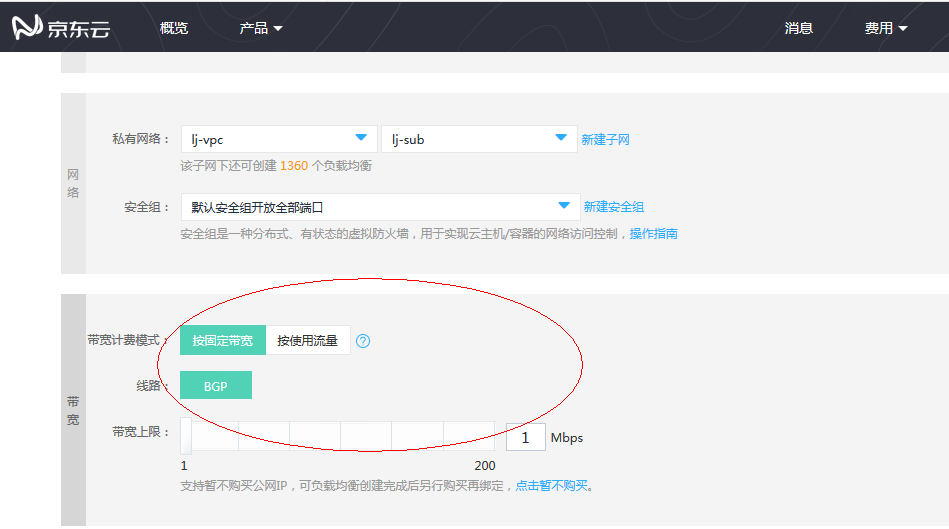
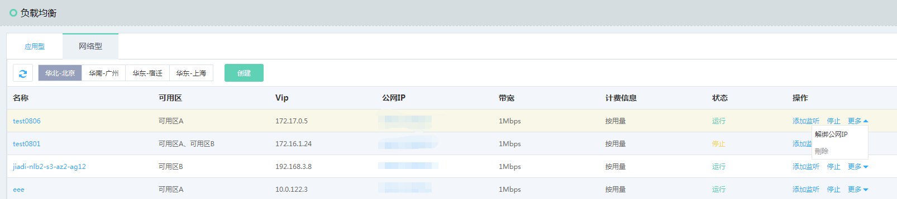

# 创建网络负载均衡实例

可根据具体的业务场景选择购买、配置公网、内网类型的网络负载均衡实例。

###### 1. 通过菜单-网络-负载均衡进入负载均衡列表页。

###### 2. 点击“创建”新建一个负载均衡实例。

###### 3. 选择负载均衡类型，此处选择网络负载均衡。

 
###### 4. 网络负载均衡参数配置：

- 选择地域，注意和需要选择的私有网络所在地域保持一致。

- 选择可用区，负载均衡将在选定可用区部署实例资源，强烈推荐选用多个可用区。

- 选择所属私有网络、子网信息，负载均衡只能将流量转发至同私有网络下的后端服务器。

- 选择公网IP计费方式：按固定带宽或者按使用流量计费；如创建内网负载均衡，可选择暂不购买，也可以在负载均衡创建完成后再绑定公网IP。

- 填写负载均衡名称、描述。

- 选择创建数量，可创建数量受负载均衡、公网IP、子网等配额限制，配额信息可通过概览页查看。

- 页面右侧确认配置及费用信息，点击 **立即购买**。

###### 5. 确认订单信息并完成支付，创建负载均衡实例。

###### 6. 完成负载均衡实例创建；因资源创建需一定时间（通常为几秒），可手动刷新列表页查看状态。

## 内网负载均衡

- 内网负载均衡只能在京东云内网使用，可以转发对京东云内网具有访问权限的客户端请求。创建内网负载均衡的步骤如下：

创建负载均衡时选择“暂不购买”公网IP，完成相关资源配置，则默认创建内网类型的负载均衡实例。
	
## 公网负载均衡

- 公网负载均衡可以将来自公网的访问请求流量转发至后端虚拟服务器，公网负载均衡需要单独购买公网IP，步骤如下：

购买负载均衡时选择公网IP（不超过公网IP可创建配额），系统会自动为负载均衡创建并绑定一个公网IP。

## 内网负载均衡转为公网负载均衡

- 京东云支持内网、公网负载均衡类型互转，内网负载均衡可通过绑定公网IP转换为公网类型的负载均衡，公网负载均衡解绑公网IP后可转换为内网类型的负载均衡。

	
