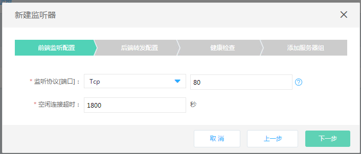
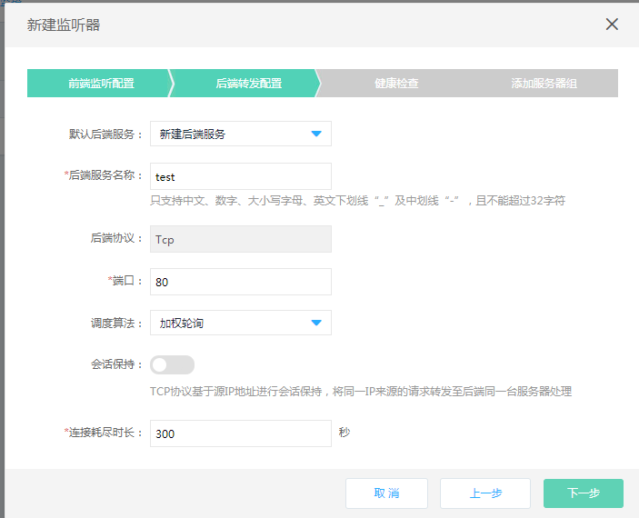
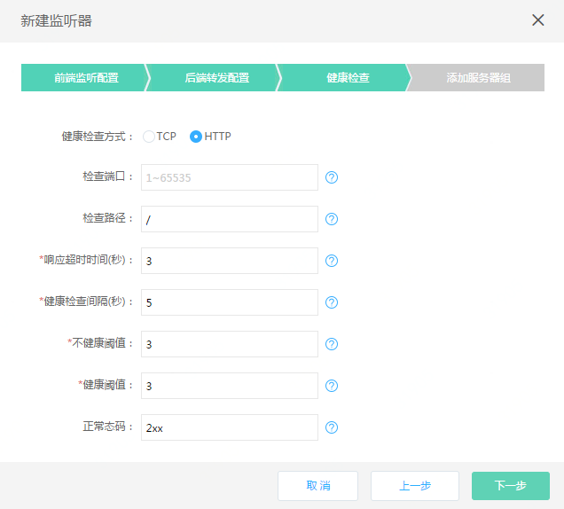
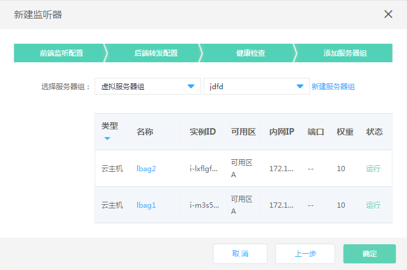

# 创建监听策略

##### 1. 通过负载均衡-详情-监听器进入监听器管理页；

##### 2. 点击新建监听器，打开监听器设置页；

##### 3. 监听器设置：
	
###### 前端监听配置：
	
- 选择前端监听协议：tcp；端口：1~65535。说明：同一负载均衡下的监听端口不可重复，监听器创建后，监听协议、端口不允许修改；

- 空闲连接超时：输入范围1~86400秒，默认1800秒。

###### 后端转发配置：

- 默认后端服务：新建或选择一个已有的后端服务，选择已有后端服务相关参数不可修改；后端服务名称：定义后端服务名称，随监听器同步创建的后端服务可在后端服务列表查看；	
	
- 后端协议：默认显示，如监听协议为tcp则后端协议为tcp；
	
- 端口：后端业务转发端口，输入范围1~65535，不同后端服务的端口可以重复；
	
- 调度算法：加权轮询、加权最小连接数、源IP，可根据实际业务需求选择；

- 会话保持：默认关闭，打开支持基于TCP的会话保持；	
	
- 连接耗尽：配置连接耗尽超时时间，范围为【0，3600】秒，缺省为300秒。

	

###### 健康检查设置：

- 选择健康检查方式：HTTP、TCP；
	
- 设置检查端口：输入范围1~65535，如不填写默认为后端实例接收负载均衡流量的端口；
	
- 响应超时时间(s)：输入范围2~60秒,此为健康检查响应的最大超时时间；
	
- 健康检查间隔(s):输入范围为5~300秒,此为健康检查的时间间隔；
	
- 不健康阈值：输入范围1~5，此为后端实例从成功到失败的连续健康检查失败次数；
	
- 健康阈值：输入范围1~5，此为后端实例从失败到成功的连续健康检查成功次数；
	
- 正常态码：输入范围2xx（等价于200-299）、3xx（等价于300-399）、4xx（等价于400-499）；
	
- 检查路径：仅健康检查方式为HTTP时填写，必须以“/”开头、最多支持5级目录，不得超过100字符。

###### 添加服务器组：

- 选择服务器组类型：虚拟服务器、高可用组，或者可以暂不添加。虚拟服务器组：系统会自动筛选出当前可以绑定的服务器组列表，如没有可用的服务器组，可点击“新建虚拟服务器组”进行创建；注：可选服务器组中的后端实例必须与负载均衡处于相同地域、私有网络；

- 高可用组：系统会自动筛选出当前可以绑定的高可用组，如没有可用的高可用组，请前往高可用组页面进行创建；注：可选高可用组中的后端实例必须与负载均衡处于相同地域、私有网络。

