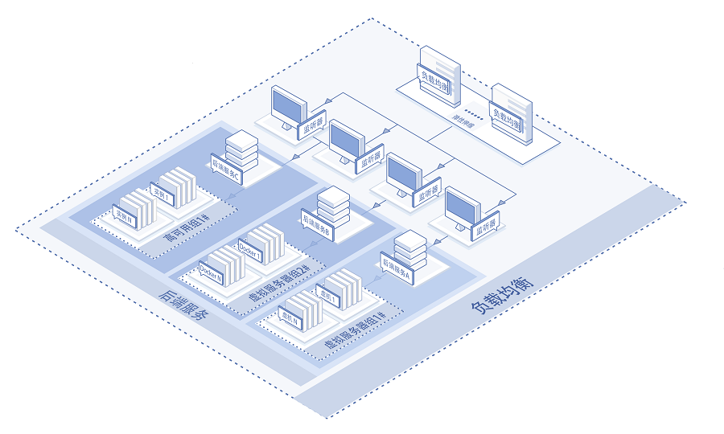
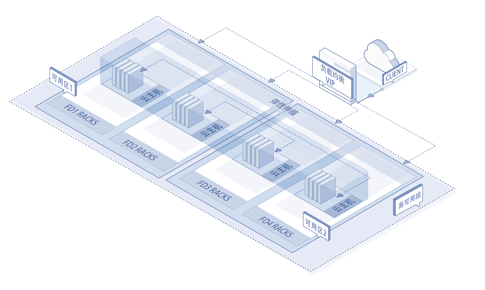
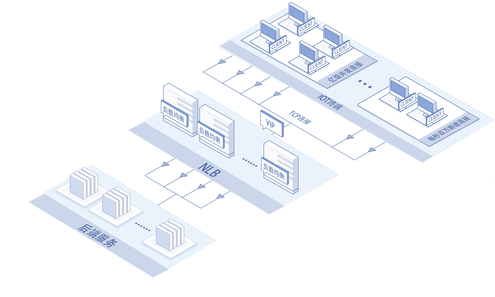

# 应用场景

以下说明网络负载均衡NLB的适用场景。

## 亿级并发、每秒百万新建连接，自动弹性伸缩业务
京东云自主研发的网络负载均衡NLB专用于提供四层、支持过亿并发连接和每秒百万级新建连接的高性能业务分发服务，能够感知用户业务量的变化、自动按需弹性伸缩，以便平滑、动态地支持用户业务访问量的变化。京东云NLB在支持自动弹缩的同时，还提供了强有力的会话保持能力，能够有效减小用户业务开发中对于会话保持的考虑与研发工作量，提升研发效率、加快业务面市节奏。网络负载均衡适合游戏、电商等高并发服务需求，同时也适用于秒杀等流量快速增减的动态服务场景。

## 高可用业务部署

京东云网络负载均衡NLB服务支持自主选择冗余配置、多可用区部署，支持高可用；绑定高可用组AG即可支持后端服务同机房跨机架、跨可用区的多维度高可用部署，消除后端服务实例由于单点设备故障造成的影响。高可用组还支持服务实例按照指定模板自动进行高可用分布的弹性伸缩能力，与负载均衡完美搭档，提供高可用、可自动伸缩的服务。NLB+AG的高可用业务部署架构，适用于所有需要提供稳定、高容错能力的业务场景，如政务服务、企业应用、互联网应用等。

## 大规模物联网应用

随着物联网技术的发展与日益成熟，越来越多的物联网应用开始步入商业服务。在这些应用中存在大规模物联网终端需要快速与应用建立连接，或者有些情况终端需要与应用服务端保持TCP长连接、以便持续快速进行数据的回传或者动态交互。这种物联网应用就对大规模TCP并发连接、以及规模新建连接提出了明确的要求，网络负载均衡可以轻松完美的应对此类场景的挑战。

## 相关参考

- [产品优势](../Introduction/Benefits.md)
- [产品功能](../Introduction/Functions.md)
- [价格总览](../Pricing/Price-Overview.md)
- [计费规则](../Pricing/Billing-Rules.md)
- [创建实例](../Getting-Started/Create-Instance.md)
