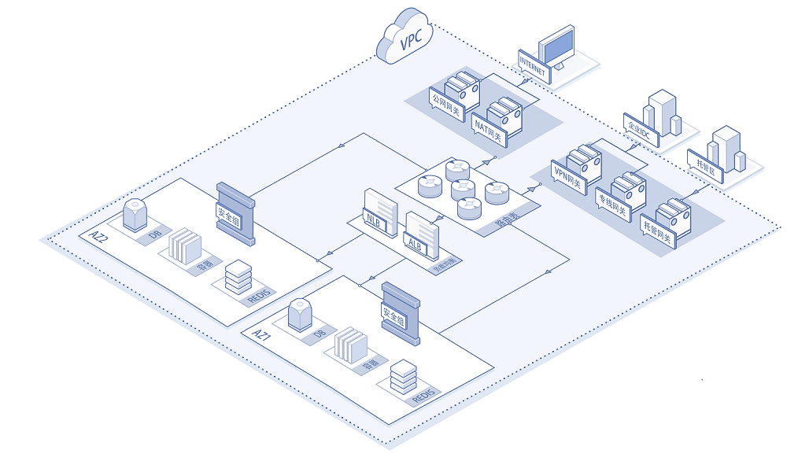
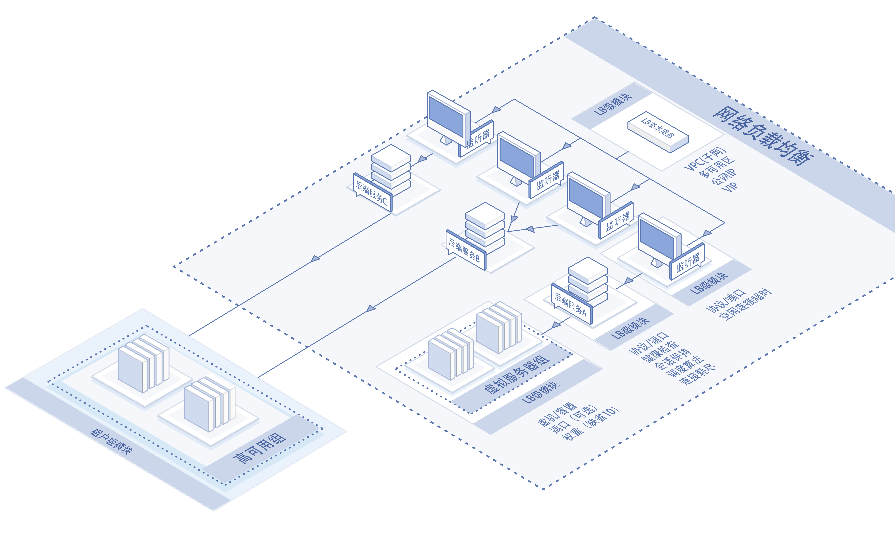
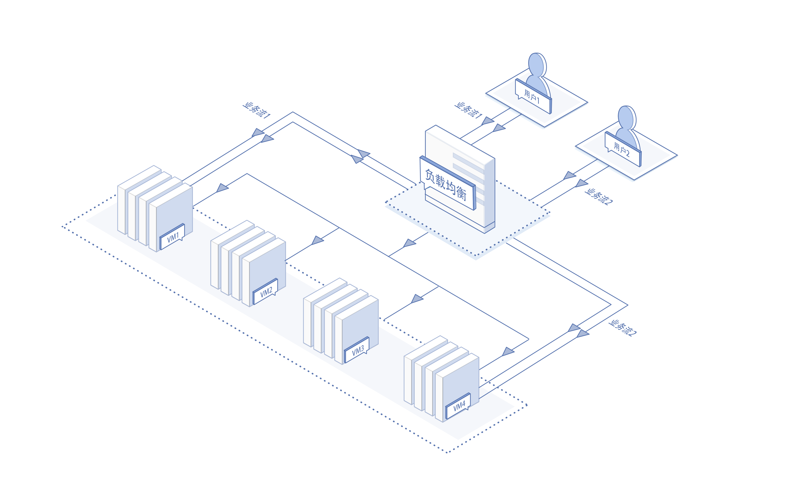
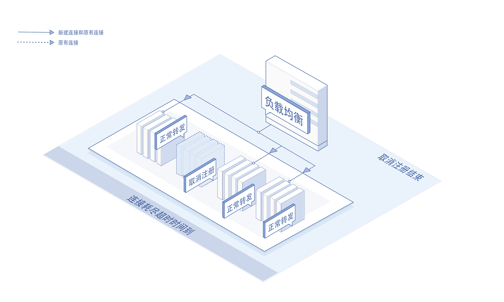

# 基础架构

----------

网络负载均衡NLB是京东云自主研发、专注四层业务服务的负载均衡产品，支持过亿并发连接和每秒百万级新建连接的高性能、低延时、会话保持等能力。NLB可自动弹性伸缩、免除用户业务规划与手动扩容的繁琐；NLB支持跨多可用区部署、并且与高可用组AG紧密配合，满足业务高可用部署需求。

网络负载均衡可将大并发流量分发到多台后端实例，调整资源利用情况，消除由于单台设备故障对系统的影响，提高系统可用性、扩展系统服务能力。

## 提供多重保障的高可用服务

京东云负载均衡提供多重机制保障服务的高可用：

- 负载均衡的高可用

1. 多可用区部署：根据业务需求，对支持多可用区的地域可选择将负载均衡实例部署在多个可用区下，一旦可用区机房故障或可用区下资源故障，可将流量自动分发至其他可用区，实现可用区级高可用；
2. 资源冗余机制：负载均衡采用集群部署，提供双活模式（单可用区下至少提供2个资源实例），如一个负载均衡服务故障，可将流量自动转发至另一个负载均衡服务，业务侧无感知。

- 后端服务器的高可用

负载均衡可绑定高可用组，根据业务流量和设备负载情况动态调整服务器数量，实现资源的合理分配，保证业务正常运行。

NLB高可用架构如下图：

# 业务架构

----------

NLB产品结构如下图：

网络负载均衡NLB组成部分

- 负载均衡实例

使用负载均衡服务前，需要购买、创建负载均衡实例，一个负载均衡实例可设置多个监听器、多个后端服务、多个虚拟服务器组，可以挂接多个高可用组。

- 监听器

进行流量负载前，需要设置至少一个监听器，指定监听协议/端口等。

- 后端服务

用于提供从负载均衡到后端服务器转发、调度策略的管理模块，包括转发协议/端口、调度算法、会话保持、转发的后端服务器组等。

- 虚拟服务器组

一组接收访问请求的云主机或容器资源，通过虚拟服务器组进行管理。虚拟服务器组可以与弹性伸缩（Auto Scaling）结合使用，以实现云主机的自动扩容与缩容，不过AS的主机分散能力较弱、不关注跨机架维度的高可用分散机制。

- 高可用组

高可用组（Availability Group）是京东云提供的云主机逻辑集合，可以支持按照用户指定主机模板进行跨机架、跨AZ的弹性伸缩，将云主机分散部署在相互隔离的物理资源上。当出现硬件或者供电故障时只会影响高可用组内部分云主机，业务仍为可用状态。

## 高复用架构说明

一个负载均衡实例下可以设置多个协议类型相同、但是不同服务端口号的监听器；

同一负载均衡下的多个监听器可以复用绑定同一个后端服务；

同一负载均衡的多个后端服务可以复用绑定同一个后端服务器组/高可用组；

同一虚拟服务器（主机/容器）可以通过不同端口注册到同一虚拟服务器组；

同一虚拟服务器（主机/容器）可注册到不同的虚拟服务器组；

同一高可用组可以挂接到同一负载均衡的多个后端服务；

同一高可用组可以挂接到多个负载均衡的后端服务。

备注：

虚拟服务器组中只能添加和所属负载均衡实例相同私有网络的服务器。

# 关键技术原理

----------

## 分流原理

来自外部的访问请求，由负载均衡实例根据相关的策略和转发规则分发到后端服务器进行处理。目前负载均衡支持的分流类型包括： 加权轮询、加权最小连接、源IP。轮询是按序逐个向后端服务实例分发连接请求，加权轮询就是按照实例的权重比例分配轮中次数。最小连接是按照负载均衡与各个后端服务实例之间的最小活跃连接数进行分发请求，加权最小连接就是最终保证负载均衡与后端服务之间的活跃连接数比例与权重比例一致。源IP是指依据请求的源IP地址进行hash，把不同源IP的请求分配到不同后端服务实例。

## 会话保持原理

会话保持又称粘滞会话(Sticky Sessions、Session affinity)。会话保持是指负载均衡器上的一种功能机制，在进行数据分发的同时保证来自同一客户端相关连的访问请求会分配到同一台服务器上。

## 连接耗尽原理

连接耗尽（Connection Draining）是负载均衡注册实例优雅退出服务的一种方式。当后端实例（虚机或者容器）从后端服务取消注册时，负载均衡将停止向退出的实例发送新的连接请求，并且保持已建立连接的服务状态、直到连接耗尽定时器超时。

## 相关参考

- [产品优势](../Introduction/Benefits.md)
- [产品功能](../Introduction/Functions.md)
- [价格总览](../Pricing/Price-Overview.md)
- [计费规则](../Pricing/Billing-Rules.md)
- [创建实例](../Getting-Started/Create-Instance.md)
- [创建虚拟服务器组](../Operation-Guide/TargetGroup-Management.md)
- [配置侦听策略](../Operation-Guide/Listener-Management.md)
- [管理后端服务与查看服务实例健康状态](../Operation-Guide/Backend-Management.md)
- [查看监控信息](../Operation-Guide/Monitoring.md)

