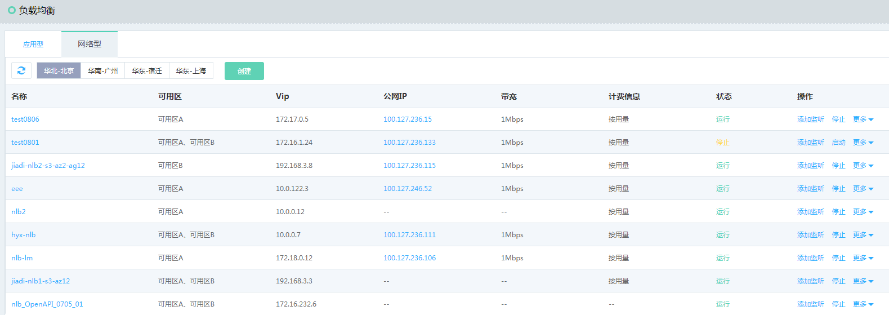
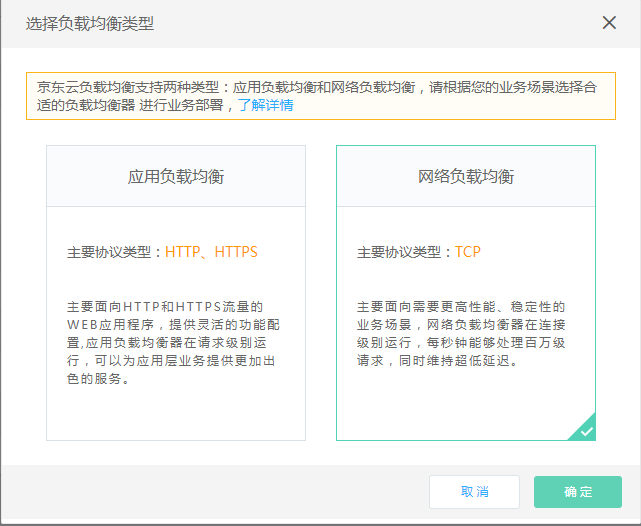
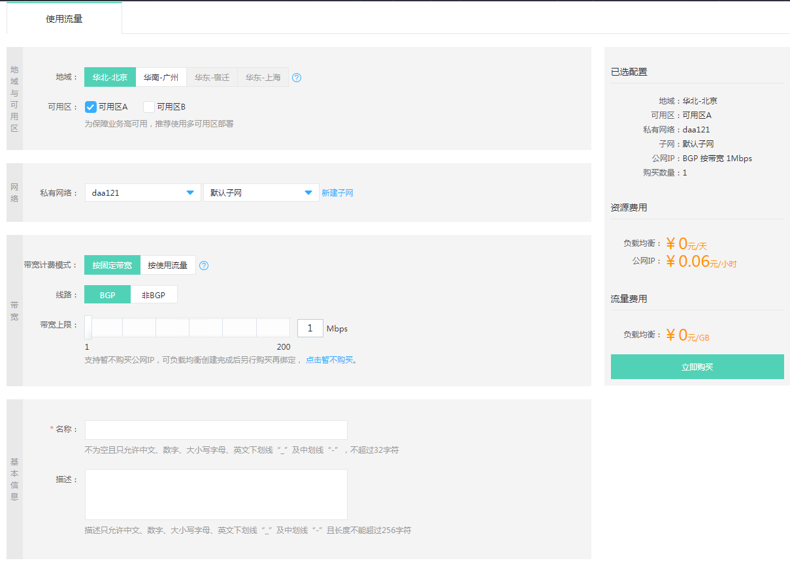
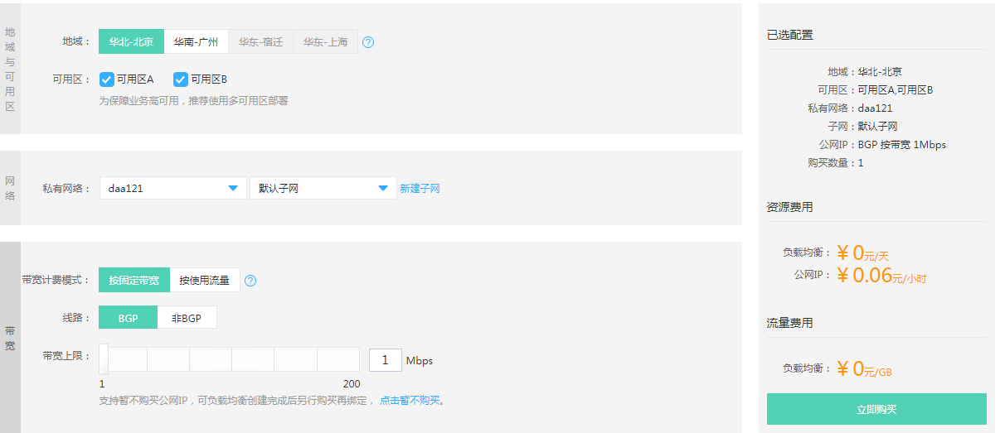

# 创建网络负载均衡

#### 1. 通过菜单-网络-负载均衡进入负载均衡列表页。
 
 

#### 2. 点击“创建”新建一个负载均衡实例。

#### 3. 选择负载均衡类型，此处选择网络负载均衡。
 
 

- 选择地域，注意和需要选择的私有网络所在地域保持一致。

- 选择可用区，负载均衡将在选定可用区部署实例资源，强烈推荐选用多个可用区。

- 选择所属私有网络、子网信息，负载均衡只能将流量转发至同私有网络下的后端服务器。

- 选择公网IP计费方式：按固定带宽或者按使用流量计费；如创建内网负载均衡，可选择暂不购买，也可以在负载均衡创建完成后再绑定公网IP。

- 填写负载均衡名称、描述。

- 选择创建数量，可创建数量受负载均衡、公网IP、子网等配额限制，配额信息可通过概览页查看。

 
   
#### 4. 页面右侧确认配置及费用信息，点击 **立即购买**。
 
 

#### 5. 确认订单信息并完成支付，创建负载均衡实例。
 
 

#### 6. 完成负载均衡实例创建；因资源创建需一定时间（通常为几秒），可手动刷新列表页查看状态。

