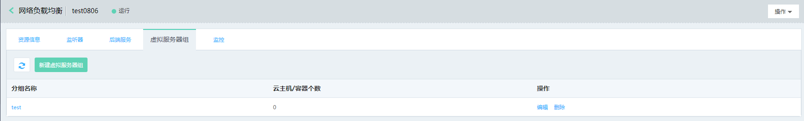
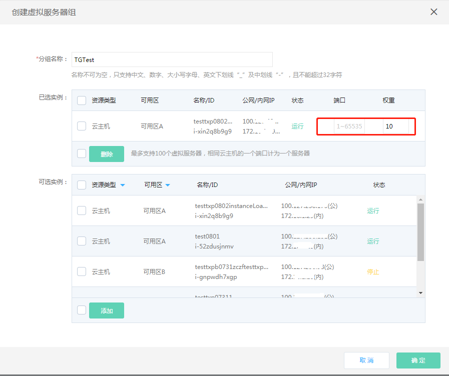
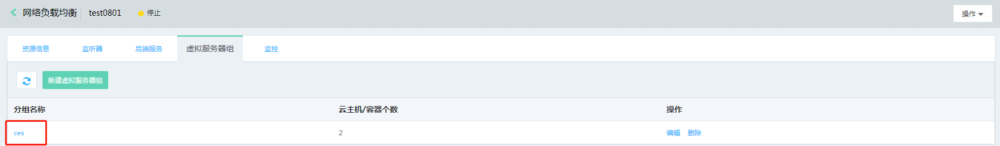
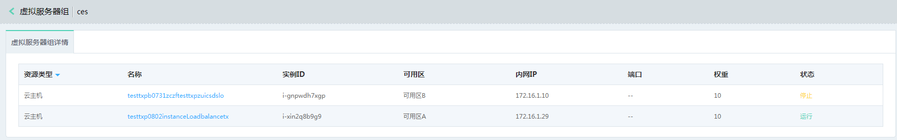
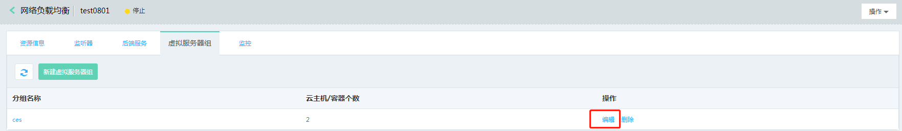
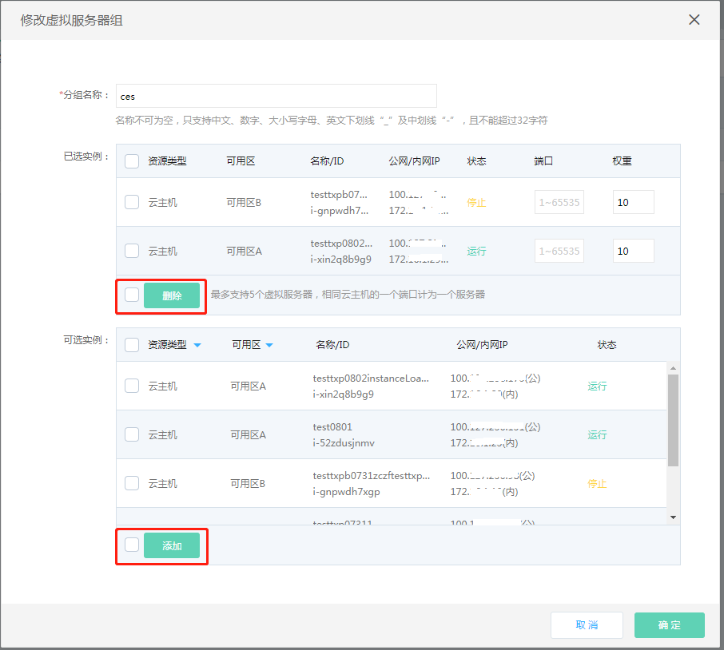

# 虚拟服务器组管理

## 添加虚拟服务器组

#### 1. 通过负载均衡-详情-虚拟服务器组进入虚拟服务器组列表页。

#### 2. 点击 **新建虚拟服务器组** 创建一个新的虚拟服务器组。

- 选择需要添加的云主机、容器实例，点击 **添加**【注：只能添加与负载均衡相同地域、可用区和私有网络的云主机、容器作为后端服务器，虚拟服务器内最多可添加100个后端服务器，相同服务器不同端口看做不同的服务器】 ；

- 设置端口和权重：为选中的服务器设置端口和权重，端口输入范围1-65535，权重输入范围1-100，同一虚拟服务器组内同一服务器端口不可重复，权重越高的服务器被转发到请求的概率越大，如端口为空则默认使用后端服务的端口进行转发。	

## 管理虚拟服务器组

#### 1. 编辑虚拟服务器组：通过虚拟服务器组列表页-操作栏，可编辑虚拟服务器组。

#### 2. 删除虚拟服务器组：通过虚拟服务器组列表页-操作栏，可删除虚拟服务器组。

#### 3. 点击虚拟服务器组名称可查看后端服务器信息。

		
## 编辑虚拟服务器组

#### 1. 通过负载均衡-详情-虚拟服务器组-编辑打开虚拟服务器组编辑页。

#### 2. 可修改服务器组名称，添加、删除虚拟服务器组内的云主机、容器资源。

		
