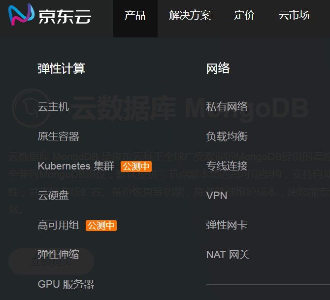
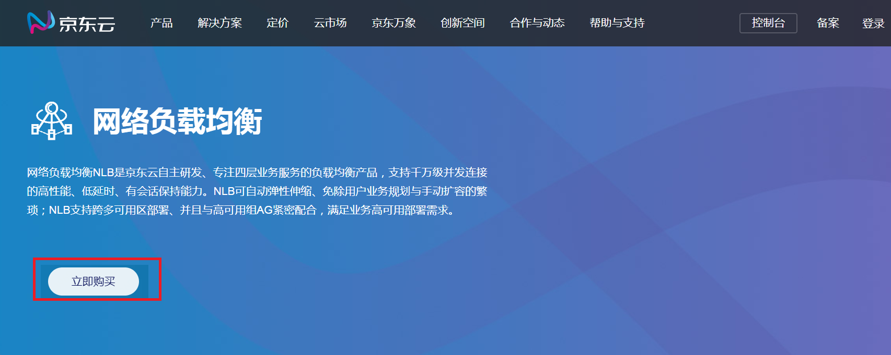

# 购买流程

本文介绍网络负载均衡的购买入口。

## 入口1：[产品介绍页](https://www.jdcloud.com/products/nlb)
1. 登录京东云官网[https://www.jdcloud.com/](https://www.jdcloud.com/)。
2. 选择“产品>网络>网络负载均衡”，具体见下图。

 

3.弹出网络负载均衡的产品介绍页，点击**立即购买**。

4.购买的具体操作，请参考[创建实例](../Getting-Started/Create-Instance.md)。

## 入口2：[负载均衡控制台](https://cns-console.jdcloud.com/host/loadBalance/list)

1. 登录京东云官网[https://www.jdcloud.com/](https://www.jdcloud.com/)。
2. 选择“控制台”，具体见下图。

3.登录控制台，具体操作请参考
[创建实例](../Getting-Started/Create-Instance.md)。
