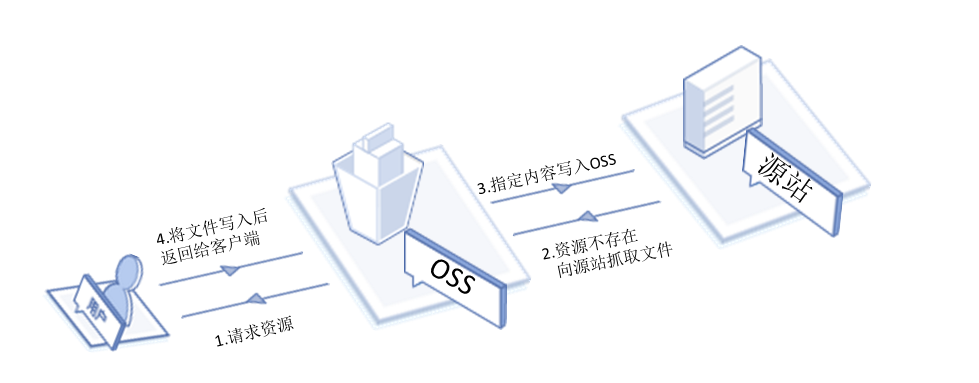

#  管理回源设置

通过回源设置，对于获取数据的请求通过镜像方式进行回源读取，满足您对于数据热迁移、特定请求重定向等需求。

您配置镜像回源规则后，对每条到OSS的Get请求的URL进行匹配，然后按照您设定的规则进行回源。最多配置5条规则，按照顺序匹配，
直到匹配到有效规则。

## 镜像方式


如果配置了镜像回写，则对一个不存在的文件进行Get操作时，OSS会向源地址请求这个文件，返回给用户，并同时写入到OSS。

## 使用场景  
镜像回源主要用于无缝迁移数据到OSS，即服务已经在自己建立的源站或者在其他云产品上运行，需要迁移到OSS上，但是又不能停止服务，此时可利用镜像回写功能实现。具体场景分析如下：

源站有一批冷数据，同时在不断的生成新的热数据。

可以先通过迁移工具将冷数据迁移到OSS上，同时配置镜像回写，将源站的地址配置到OSS上。当将域名切换到OSS上（或者京东云的CDN，回源到OSS）之后，就算有一部分新生成的数据没有迁移过来，依然可以在OSS上正常访问到，且访问一次后文件就会存入到OSS。域名切换后，源站已经没有新的数据产生了，此时再扫描一次，将还没有导过来的数据一次性导入到OSS，然后将镜像回写配置删除。

如果配置的回源是IP地址，那么将域名迁移到OSS后还可以继续镜像到源站，但是如果配置的是一个域名，由于域名本身会解析到OSS或者CDN，那么镜像就失去作用了，在这种情况下，可以另外申请一个域名作为镜像的源站，这个域名与正在服务的域名解析到同一个IP地址，这样服务域名迁移的时候就可以继续镜像到源站了。

只切换源站的部分流量到OSS或者CDN，源站本身还在不断的产生数据。

迁移方式与上述方式类似，只是流量切换到OSS后，不要将镜像回写配置删掉，这样可以保证切换到OSS或者CDN的流量还是能够取到源站的数据。

细节分析

* 有当GetObject()本应该返回404的情况下，OSS才会执行镜像回源，向源站请求文件。
* 源站请求的URL为MirrorURL+object，回写到OSS的文件名为“object”，例如bucket为example-bucket，配置了镜像回写，MirrorURL为http://www.example-domain.com/，文件image/example_object.jpg不在这个bucket里面，此时去下载这个文件时，OSS将向http://www.example-domain.com/image/example_object.jpg发起GET请求，并将结果同时返回给用户以及写入到OSS，当下载完成后，这个文件就已经存在OSS上了，文件名为image/example_object.jpg，此时相当于将源站的文件同名的迁移到了OSS上。如果MirrorURL带有path信息，比如http://www.example-domain.com/dir1/，则与上例相同，OSS回源的URL为http://www.example-domain.com/dir1/image/example_object.jpg，写入到OSS的object依然是image/example_object.jpg，此时相当于将源站的某一个目录下的文件迁移到OSS上。
* 给OSS的header信息默认是不会传递给源站。但是支持用户根据实际业务指定header，详见[设置回源规则](../../dd.md)。
* querystring信息是否会传递给源站取决于用户的配置，详见[设置回源规则](../../dd.md)。
* 如果源站是chunked编码返回，那么OSS返回给用户的也是chunked编码。
* OSS会将源站的以下头信息返回并存为OSS的头信息：
 ``` 
 
Content-Type
Content-Encoding
Content-Disposition
Cache-Control
Expires
Content-Language
Access-Control-Allow-Origin

```

* 假设文件已经通过镜像回写到了OSS，如果源站的相同文件发生了变化，那OSS不会更新已经存在于OSS上的文件，因为此时文件已经在OSS上，不符合镜像回写的条件。
* 如果镜像源站也无此文件，即镜像源返回给OSS的http status为404，那么OSS也返回404给用户，如果是其他非200的状态码（包括因为网络原因等获取不到文件的错误情况），OSS将返回424给用户，错误码为“MirrorFailed”。

## 功能使用参考
控制台：[管理回源规则](../../dd.md)

