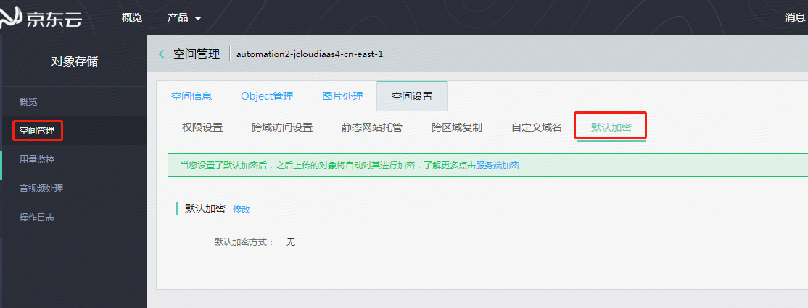
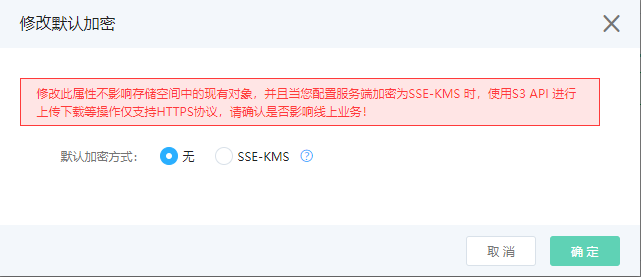

# 设置镜像回源规则 

您可以设置镜像回源规则，当请求在OSS中没找到文件时，会自动到源站抓取对应文件保存到OSS，并将内容直接返回给用户。
设置回源规则可以满足您对于数据热迁移、特定请求的重定向等需求。

**说明：** 镜像回源不支持内网 endpoint，外网流量按正常收费。

## 使用OSS管理控制台，设置镜像回源。

1.登入控制台->对象存储->空间管理->进入某个Bucket->空间设置->镜像回源



2.点击设置规则，进入镜像回源规则列表页。



3. 单击**创建规则**，在创建弹框中设置**回源条件**和**回源地址**。还可以根据实际需要选择设置是否**携带请求字符串**；设置3xx 请求响应是否跟随源站重定向请求
   同时支持通过设置HTTP header传递规则，进行自定义透传、过滤或者修改。
   **说明：** 
    -  回源地址为必填项，支持域名与IP，支持端口。
    -  携带请求字符串，会将 OSS 请求中的 queryString 传递到源站
    - 3xx 请求响应设置默认会跟随源站重定向请求获取到资源，并将资源保存到 OSS 上。若不勾选，OSS会透传 3XX 响应，不获取资源。
    - HTTP header传递规则:
      默认传给OSS的header信息不会传递给源站
      自定义规则允许您指定允许、禁止、设置指定header参数，
      
     

    配置举例如下：

    

    根据以上配置，如果用户发送到OSS的请求（HTTP header部分）如下：

    ```
    GET /object
    host : bucket.s3.cn-north-1.jcloudcs.com
    aaa-header : 111
    bbb-header : 222
    ccc-header : 333
    ```

    则触发镜像回源后，OSS发送给源站的请求如下：

    ```
    GET /object
    host : source.com
    aaa-header : 111
    ccc-header : 000
    
    ```

    **说明：** 
    1.传递所有 HTTP header会将所有header透传过去，包括host头（一般是bucketname.endpoint，如bucketname.s3.cn-north-1.jcloudcs.com），

    由于大部分源站会对host头做校验，可能导致源站无法识别请求，所以您要慎重勾选。如果您确定要透传所有 header，请尽量在[禁止传递指定 HTTP header]中配置

    禁止传递host头和其他可能会影响源站识别的header。
    
    2. 以下HTTP header类型不支持设置HTTP header传递规则：

    -   以下前缀开头的header：
    
        -   x-oss-
        -   oss-
        -   x-aws-
        -   x-jdcloud
        -   x-drs-
        
        
    -   所有标准HTTP header，例如：
        -   authorization2
        -   authorization
        -   content-length
        -   range
        -   date
8.  单击**确定**。

**说明：** 规则保存成功后，您可以在镜像回源规则列表中查看已设置的回源规则，并进行编辑、删除或是排序等操作。


