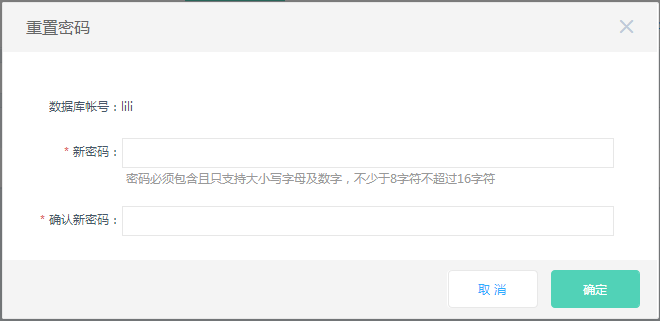

# 重置密码
在使用区块链数据服务过程中，如果忘记数据库账号密码或者需要修改密码，可以通过 区块链数据服务控制台 重新设置密码。 

## 注意事项
* 为了数据安全，建议定期更换密码。

## 操作步骤
1. 登录 [区块链数据服务控制台](https://bds-console.jdcloud.com/block/list)。 
2. 选择需要重置账号密码的目标实例，点击目标实例，进入实例详情页 。
3. 点击 **账号管理** Tab 页， 选择目标账号，在操作中点击 **重置密码** ， 弹出框参数说明如下:
    * 密码：密码的长度和字符有一定限制，具体以控制台为准。
    
4. 点击 ***确定*** 按钮，完成密码修改。
