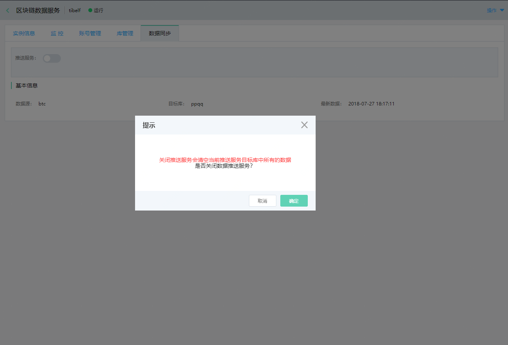

# 关闭数据同步
如果您想不再新建新的实例的情况下，获取其他数据源的数据，可以选择先关闭数据同步服务，然后再重新开启，选择您想同步的数据源即可。

关闭同步服务，会同步删除包括开启同步服务时候创建的库和账号，也就意味着原先同步的数据源的所有数据都会被删除。

## 前置条件
* 区块链数据服务实例状态为 ***运行***

## 操作步骤
1. 登录 [区块链数据服务控制台](https://bds-console.jdcloud.com/block/list)。 
2. 选择需要关闭数据同步服务的目标实例，点击目标实例，进入实例详情页。
3. 选择 **数据同步** 标签，点击关闭推送服务按钮，弹出框参数说明如下：
    * 点击 ***确认*** 按钮，完成关闭同步服务操作。
    * 点击 ***取消*** 按钮，放弃关闭同步服务操作。
    

4. 点击 **确定** 按钮，关闭数据同步服务。

